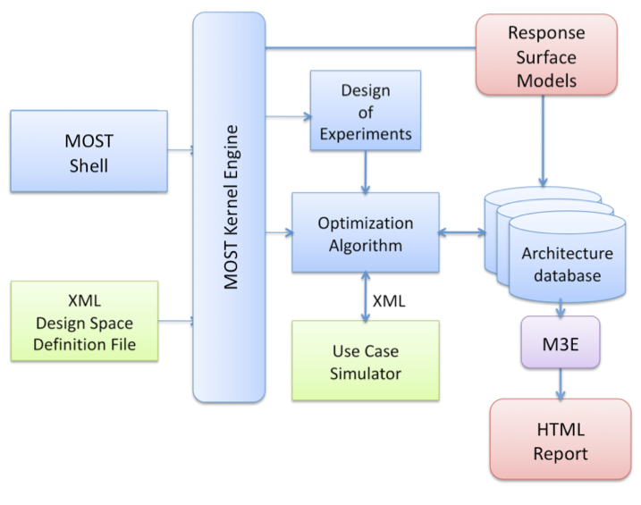

# Introduction

This manual describes **MOST** (Multi-Objective System Optimizer) a tool for
architectural design space exploration. **MOST** is an interactive program that
lets the designer explore a design space of configurations for a particular
architecture for which an executable model (or _driver_) exists. **MOST** can be
extended by introducing new optimization algorithms such as Monte Carlo
optimization, sensitivity based optimization and, as an example, Taguchi design
of experiments. All of this by using an appropriate API.

The overall goal of this framework aims at providing a methodology and a
re-targetable tool to drive the designer towards near-optimal solutions to the
architectural exploration problem, with the given multiple constraints. The
final product of the framework is a Pareto curve of configurations within the
design evaluation space of the given architecture. To meet this goal we
implemented a skeleton for an extendible and easy to use framework for
multi-objective exploration.

The strength of **MOST** is that drivers and optimization algorithms can be
dynamically linked within **MOST** at run-time, without the need of recompiling
the entire code base. This is supported by well defined interfaces between the
driver and the optimization algorithms versus the kernel of **MOST**. We believe
that this will strongly support the introduction of new modules for both
academic and industrial purposes.

The proposed DSE framework is flexible and modular in terms of: target
architecture, system-level models and simulator, optimization algorithms and
system-level metrics.

## Basic usage of MOST

Essentially, two kinds of user agents are assumed to interact with the
exploration framework:


- **Use case provider**. This is the provider of the use case and its associated
  system model (able to be automatically executed) to be explored.

- **Exploration architect**. This is the user architect who is responsible of
  identifying the optimal configuration of the architecture underlying the use
  case.

A use case is defined as the target problem to be solved. The system model of
the use case is a single executable file (binary or script), which interacts
with the design space exploration tool to provide the value of the estimated
metrics, given an input configuration. In literature, the system model is also
referred to as _solver_ or _simulator_.

We define the interface between the Design Space Exploration Tool and the
exploration architect as the human-computer-interaction interface. This
interface can be GUI (Graphical User Interface)-based or command-line-based and
it is used for specifying and solving the exploration problem in terms
optimization metrics and constraints.

The DSE tool interacts with the system model by means of the system parameters
representing one of the instances of the design space and receives back the
evaluation of the system configuration (system metrics) through the system
model.

## Overall structure of **MOST**

The following figure presents the modular structure of **MOST**. We can divide
its modules into three different categories:



- **MOST** internal modules. They are represented in blue in the above figure.
  They are composed by the **MOST** Kernel, the **MOST** shell, the **MOST**
  internal database management and the design of experiments and optimization
  modules. In the following, each module is described more in detail:

  - The **MOST** Kernel engine represents the core of the design space
    exploration tool. It orchestrates the optimization process by invoking the
    constituent and inter-changeable blocks of the framework.

  - The **MOST** shell is the command line interpreter. By using this shell (or
    equivalent _batch_ scripts) it is possible to specify the optimization
    problem and the related exploration strategy. This particular interface is
    suitable for remote execution of design space exploration on server farms.

  - The **MOST** interpreted language gives now the possibility to define
    complex objective functions (see `set_objective` command) that can be
    function of _metrics_ and _parameters_ and to specify constraints on the
    designs (see `set_constraint` command).

  - The **MOST** internal database manager is used to store all the results
    coming from simulations. Moreover, it is used for combining metrics values
    (as estimated by the simulator) into objective functions, to train
    analytical models (RSM) and to generate output reports of the exploration
    process (such as _Pareto sets_).

  - The design of experiments and optimization modules are the basic components
    for building the exploration strategies. The internal organization of the
    software has been factored in order to provide standard and common APIs for
    the various modules associated with the fundamental functionalities of
    **MOST**. The standard API consists of a corresponding dynamic linkable
    object interface which can be used to develop new models, aside from the
    existing ones.

- **MOST** external modules. They are represented in red in the above figure.
  Those modules are within the **MOST** package but are composed of external
  executables that will be called through the **MOST** interfaces. In
  particular, they are represented by the response surface models. The response
  surface models (RSM) are used for building analytical models of the target
  system response. A similar standard data interchange format (as previously
  done for DoE and optimizers) is used for supporting the introduction of
  response surface models in **MOST**.

- **MOST** problem dependent parts. They are represented in green in the above
  figure. Those blocks are not parts of **MOST** but are interfaced in a
  standard way. The design space definition file is the place where the domain
  of the optimization problem is defined while the use case simulator is the
  system model of the target problem.

## **MOST** Design of Experiments

The term _design of experiments_ (DoEs) is used to identify the _plan_ of an
information-gathering experimentation campaign where a set of variable
parameters can be tuned. We define an _experiment_ as the evaluation of the
system models with a system configuration. The reason for using DoEs is that,
very often, the designer is interested in the effects of some parameter’s tuning
on the system response. DoEs is a discipline that has very broad application
across natural and social sciences and encompasses a set of techniques whose
main goal is the screening and analysis of the system behavior with a small
number of simulations. Each DoE plan differs in terms of the layout of the
selected design points in the design space.

The following set of design of experiments modules have been implemented into
the **MOST** framework (you can find a detailed description of each DoE in a
dedicated manual):

- Full search DoE: generates all the designs of the design space (by taking into
  account optional boundaries for each parameter).

- Neighborhood DoE: generates all the designs in the neighborhood range of a
  design point.

- Random DoE: generates a set of random design points.

- Replica DoE: generates a set of design points that replicate those existing in
  a database.

- Two level full factorial DoE: In statistics, a two-level full factorial
  experiment is an experiment whose design consists of two or more parameters,
  each with discrete possible values or levels and whose experimental units take
  on all possible combinations of the minimum and maximum levels for such
  parameters. Such an experiment enables the evaluation of the effects of each
  parameter on the response variable, as well as the effects of interactions
  between parameters on the response variable.

- Box-Behnken DoE. The Box-Behnken DoE is suitable for constructing RSM
  quadratic models where parameter combinations that are at the center of the
  edges of the design space in addition to a design with all the parameters at
  the center. The main advantage is that the parameter combinations avoid taking
  extreme values taken at the same time (in contrast with the central composite
  design). This may be suitable to avoid singular points in the generation of
  the response surface, which would deteriorate it.

- Central Composite Deisgn (CCD) DoE: A central composite design is an
  experimental design specifically targeted to the construction of response
  surfaces of the second order (quadratic) without requiring a three-level full
  or fractional factorial DoE. The design consists of the following three
  distinct sets of experimental runs: 1) a two-level full or fractional
  factorial design; 2) a set of center points, i.e., experimental runs whose
  values of each parameter are the medians of the values used in the factorial
  portion; and 3) a set of axial points, i.e., experimental runs that are
  identical to the center points except for one parameter. In the general
  central composite design, this parameter will take on values both below and
  above the median of the two levels.

## Optimization algorithms

An optimisation algorithm describes the steps to be followed and the
configuration to be visited to optimize the target problem. The following set of
optimization modules have been implemented into the **MOST** framework:

- Parallel DoE: This algorithm evaluates all the designs specified by a DoE by
  using the possibility of performing concurrent evaluation of the different
  design points.

- Steepest descent: It is also called Greedy and it is a single objective
  optimization algorithm. It first evaluates all the designs specified by a DoE
  and then starts to greedly move within the design space towards a local
  minimum.

- NSGA-II: In a Genetic Algorithm, many design alternatives belonging to design
  space are seen like individuals in a stored population. The exploration
  procedure consists of the simulation of the evolution process of generation of
  individuals and the improvement of solutions belonging to next generations is
  explained by Darwinian theory. he evolutionary operators describe how
  individuals are selected to reproduce, how a new generation of individuals is
  generated from parents by crossover and mutation and how new generation of
  individuals is inserted into population replacing or not the parents. The
  implemented approach for Multiobjective optimization is the non-dominated
  sorting genetic algorithm (NSGA-II) described in: Kalyanmoy Deb,Amrit
  Pratap,Sameer Agarwal,T. Meyarivan,”Afast and elitist multiobjective genetic
  algorithm: NSGA-II”, IEEE Transactions on Evolutionary Computation, 2002

- Multi-objective simulated annealing algorithms. Simulated annealing is a Monte
  Carlo approach for minimizing multivariate functions. The term simulated
  annealing derives from the analogy with the physical process of heating and
  then slowly cooling a substance to obtain a strong crystalline structure. In
  the Simulated Annealing algorithm a new configuration is constructed by
  imposing a random displacement. If the cost function of this new state is less
  than the previous one, the change is accepted unconditionally and the system
  is updated. If the cost function is greater, the new configuration is accepted
  probabilistically; the acceptance possibility decreases with the temperature
  (optimization time). This procedure allows the system to move consistently
  towards lower cost function states, thus jumping out of local minima due to
  the probabilistic acceptance of some upward moves. The multi-objective version
  implemented in this optimizer is described in: Smith, K. I.; Everson, R. M.;
  Fieldsend, J. E.; Murphy, C.; Misra, R., Dominance-Based Multiobjective
  Simulated Annealing,IEEE Transaction on Evolutionary Computation, 12(3):
  323-342, 2008.

## Response Surface Modelling techniques

Response Surface Modeling (RSM) techniques allow determining an analytical
dependence between several design parameters and one or more response variables
(what we called system metrics). The working principle of RSMs is to use a set
of simulations either generated ad hoc by a Design of Experiment (DoE) or
obtained by an exploration strategy applied before to the design space, in order
to obtain a response model.

A typical RSM flow involves two main phases: a _training phase_ and a
_prediction phase_. While in the training phase, known data (also known as
training set) is used to identify the RSM configuration, in the prediction phase
the RSM is used to forecast unknown system response. RSMs are an effective tool
for analytically predicting the behaviour of the system platform without
resorting to a system simulation.

The **MOST** response surface modelling functionality is composed of set of
analytical models and a special data interchange format. The models have been
implemented as external programs by using common development frameworks such the
GNU Scientific Library, R and other well-known model building libraries such as
FANN (for neural networks). The modules available in **MOST** are:

- Linear Regression. Linear regression is a regression method that models a
  linear relationship between a dependent response function <!--$f$--> and some
  independent variables <!--$x_i, i = 1 \ldots p$--> plus a random term. The
  linear regression is the most common used analytical technique for
  understanding the relationship among system metrics and system parameters.

- Radial Basis Functions. Radial basis functions (RBF) represent a widely used
  interpolation/approximation model for multivariate problems. In particular,
  Radial functions are special classes of functions that have as main
  characteristic feature the fact that their response decreases (or increases)
  monotonically with distance from a central point. The version implemented is
  described in Buhmann, Martin D. Radial Basis Functions: Theory and
  Implementations, Cambridge University Press, 2003.

- Shepard Interpolation. The Shepard Interpolation technique is a well-known
  method for multivariate interpolation. This technique is also called inverse
  distance weighting (IDW) method because the value of the response function in
  unknown points is the sum of the value of the response function in known
  points weighted with the inverse of the distance. The inverse distance
  weighted (IDW) interpolation is one of the most commonly used techniques for
  interpolation of scatter points. Inverse distance weighted methods are based
  on the assumption that the interpolating surface should be influenced most by
  the nearby points and less by the more distant points. The interpolating
  surface is a weighted average of the scatter points and the weight assigned to
  each scatter point diminishes as the distance from the interpolation point to
  the scatter point increases. The version implemented in this RSM technique is
  derived from Karen Basso, Paulo Ricardo, De Ávila Zingano, Carla Maria, Dal
  Sasso Freitas. Investigating Alternatives for the Interpolation of Scattered
  Data for Modified Shepard Method. IEEE Symposium on Computer Graphics and
  Image Processing, 1999.

## Design space analysis reports

The user interface associated with the **MOST** tool is able to generate both
textual report of the exploration (configuration and objective pairs) and 2D and
3D plots on the objective functions and metrics. A more comprehensive HTML
reports can be generated by the external Multicube Explorer tool (if it is
installed on the machine).

- Textual reports: **MOST** tools gives the possibility to presents the
  exploration results by using textual reports, such as CSV for further analysis
  by using standard tools.
- Graphical 2D and 3D plots: **MOST** provides two commands that are able to
  generate 2D and 3D plots of metrics and objective functions by creating and
  launching gnuplot scripts for plotting capability.

## Integration of external use-cases by using the MULTICUBE-XML interface

The **MOST** framework has been developed by using the MULTICUBE-XML interface
(also called DSE-XML interface) for the integration of external
simulators/system models. The MULTICUBE-XML interface has been specified in the
MULTICUBE FP7 project (www.multicube.eu) as a unique interface for enabling the
integration of system models coming from different use case providers for design
space exploration purposes.

The goal of the DSE-XML interface is to addresses the interaction between the
simulator and the design space exploration tools (see figure <!--\ref{xml}-->,
which is essentially an automatic program-to-program interaction. In general,
the interaction can be described as following:


1. The design space exploration tool generates one feasible system configuration
   whose system metrics should be estimated by the simulator.

2. The simulator generates a set of system metrics to be passed back to the
   design space exploration tool. The specification of the formats of the
   input/output data to/from the simulator is defined as the explorer/simulator
   interface.

In order to link the use case and the simulator to the design space exploration
tool, a design space definition file should be released by the use case and
simulator provider together with the executable model of the use case
(simulator). This file describes the set of configurable parameters of the
simulator, their value range and the set of evaluation metrics that can be
estimated by the simulator. This file describes also how to invoke the simulator
as well as an optional set of rules with which the generated parameter values
should be compliant. The rules are only used by the exploration tool in order to
do not generate invalid or unfeasible solutions during the automated exploration
process.

The DSE-XML specification provides an XML based grammar for writing both the
design space definition file and the simulator interface files. Please check the
specific document within the provided manuals for more details.

# An example usage of **MOST**

In order to better clarify the previous concepts into a practical case, here we
will present a simple example where the goal is to explore the effect of the
basic GCC options used for compiling a target application. The metrics of
interest in such a case will be the time needed for the compilation process,
size of the generated binary file and the time needed for the execution of the
compiled application.

In order to manage this problem within the **MOST** DSE framework we need first
to formally define what is the design space to be explored and than to create a
use case simulator/model compliant with the interfaces specification described
in the previous sections.

Regarding the definition of the design space, two parameters (optimization
`par_opt` and debug `par_dbg` options):

- Optimization options parameter values:

  - “-O”: The compiler tries to reduce code size and execution time, without
    performing any optimizations that take a great deal of compilation time;

  - “-O0”: Reduce compilation time and make debugging produce the expected
    results. This is the default during GCC compilation;

  - “-O1”: Optimizing compilation takes somewhat more time, and a lot more
    memory for a large function;

  - “-O2”: GCC performs nearly all supported optimizations that do not involve a
    space-speed tradeoff. As compared to -O, this option usually increases both
    compilation time and the performance of the generated code;

  - “-O3”: Optimize yet more. -O3 turns on all optimizations specified by -O2
    and also turns on the -finline-functions, -funswitch-loops,
    -fpredictive-commoning, -fgcse-after-reload, -ftree-vectorize and
    -fipa-cp-clone options;

  - “-Os”: Optimize for size. -Os enables all -O2 optimizations that do not
    typically increase code size. It also performs further optimizations
    designed to reduce code size.

- Debug options parameter values:

  - “-g”: Produce debugging information in the operating system's native format
    (stabs, COFF, XCOFF, or DWARF 2). GDB can work with this debugging
    information. GCC allows you to use -g with -O. The shortcuts taken by
    optimized code may occasionally produce surprising results: some variables
    you declared may not exist at all; flow of control may briefly move where
    you did not expect it; some statements may not be executed because they
    compute constant results or their values were already at hand; some
    statements may execute in different places because they were moved out of
    loops.

  - “ ”: None. The debugging options are not enabled.

- Metrics contained with the system model:

  - Compilation Time: Time needed only for the compilation process;

  - Execution Time: Time needed only to execute the compiled target application;

  - Code Size: Size of the generated binary file.

Regarding the creation of compliant interface with the **MOST** framework, we
wrapped the compilation process through GCC and the evaluation of the metrics
within a python script (gcc_most.py)

This will enable the tool to be launched within a single executable file/script
as follows:

```shell
python gcc_most.py --file=<target_filename>.c  \
      --xml_system_configuration=<input_filename>.xml \
      --xml_system_metrics=<output_filename>.xml
```

and to read and write **MOST** xml configuration and metrics file respectively.

Finally, in order to launch the exploration by using **MOST** we need to specify
the XML design space definition file:

```xml
<?xml version="1.0" encoding="UTF-8"?>
<design_space xmlns="http://www.multicube.eu/" version="1.3">
<simulator>
        <simulator_executable path="/usr/bin/python /path/to/gcc_most.py --file=linpack.c" />
</simulator>
<parameters>
<parameter name="par_opt" type="string">
    <item value="-O"/>
    <item value="-O0"/>
    <item value="-O1"/>
    <item value="-O2"/>
    <item value="-O3"/>
    <item value="-Os"/>
</parameter>
<parameter name="par_dbg" type="string">
    <item value=" "/>
    <item value="-g"/>
</parameter>
</parameters>
<system_metrics>
        <system_metric name="compilation_time" type="float" unit="sec" desired="small" />
        <system_metric name="execution_time" type="float" unit="sec" desired="small" />
        <system_metric name="code_size" type="float" unit="Byte" desired="small" />
</system_metrics>
</design_space>
```

To perform the exploration (find the optimal values for the two parameters that
minimize the system metrics) we need to specify now the planned exploration
strategy in terms of sequence of DoE, Optimizers and post processing steps by
the usage of the MOST scripting language.

The following is a simple example of MOST script where a full search is done on
the design space and the objectives of the optimization are only the execution
time and code size, while the compilation time is used only as a metric useful
for analysis purposes:

    # Here are the declaration of the objective functions
    # objectives are the goal for the optimization step
    # Execution_time and code size are metrics defined in the DS

    # Step 1. set the objectives for each design x

    set_objective obj_a(x) = execution_time($x)
    set_objective obj_b(x) = code_size($x)

    # Step 2. Define an initial Doe and an optimizer.
    # Here, the optimizer just executes the defined Doe, nothing else

    doe_load_doe "st_full_search"
    opt_load_optimizer "st_parallel_doe"

    # Step 3. Invoke the optimizer and write designs and metrics into FULL_DB (database)
    opt_tune FULL_DB

    # Step 4. Filter out non-dominant configurations considering also the constraints
    db_filter_pareto FULL_DB --valid=TRUE

    # Optionally Export of all the simulation results in a CSV file
    db_export FULL_DB --file_name=all.csv
